# Домашнее задание №12 (Тема "Секционирование")

 __*Разворачиваю виртуальную машину, на ней устанавливаю PostgreSQL 15 версии. Далее на виртуальную машину записываю резервную копию демонстрационной базы данных Demo в подготовленную заранее директорию /home/postgres/backup.*__
> 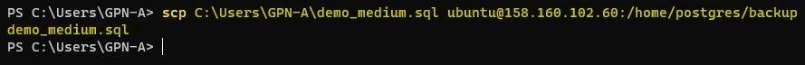

 __*Далее выполняю полученный скрипт:*__
> 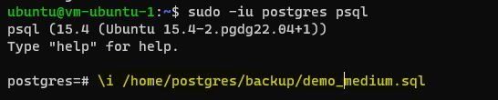

 __*Убеждаюсь, что демонстрационная база данных Demo создалась:*__
> 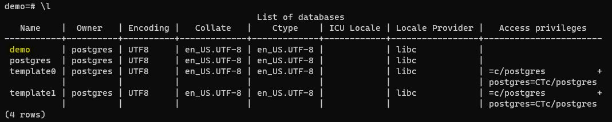

 __*В базе данных уже присутствуют таблицы с данными:*__
> 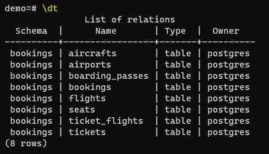

 __*Просмотрев все таблицы, их структуру, решаю секционировать таблицу bookings по диапазону дат (т.е. по полю book_date):*__
> 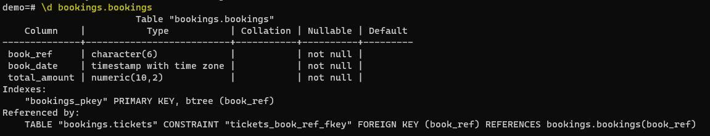

 __*Новую таблицу с именем bookings_part создаю следующим образом:*__
> 

 __*Далее создаю отдельные секции на каждый месяц:*__
> 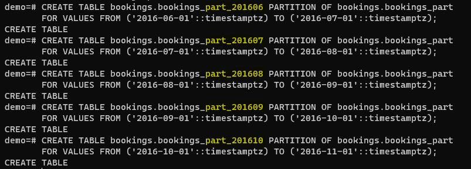

 __*После создания отдельных секций для таблицы bookings_part смотрю получившееся описание:*__
> 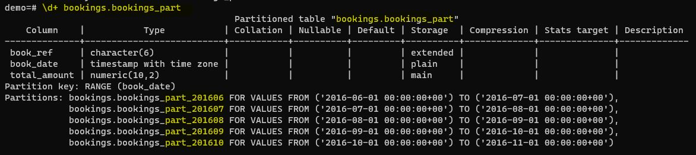

 __*Теперь выполняю вставку данных из "старой" таблицы bookings в секционированную таблицу bookings_part. Должно произойти автоматическое распределение записей по созданным секциям.*__
> 

 __*Чтобы убедиться, что данные распределились по секциям, подсчитаю количество записей в каждой из секции:*__
> 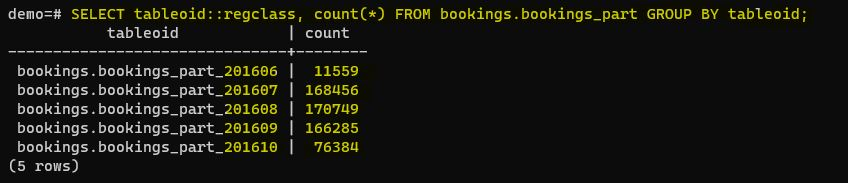

 __*Убедился, что при выполнении поиска данных  планировщик обращается в требуемую секцию, а не просматривает все секции последовательно:*__
> 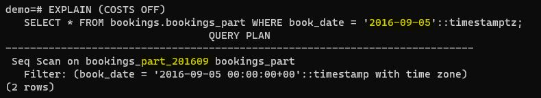

 __*На прошлом шаге обратил внимание, что используется Seq Scan — то есть чтение данных таблицы bookings_part последовательное, блок за блоком. Нужно создать индекс.*__
> 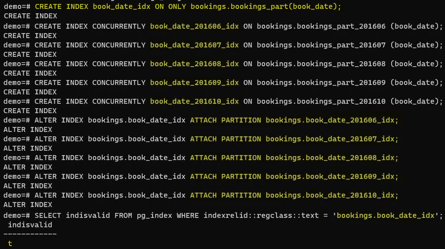

 __*qqq*__
> 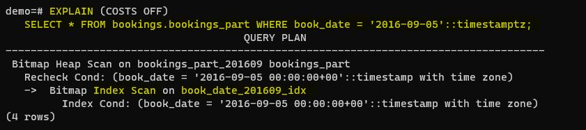

